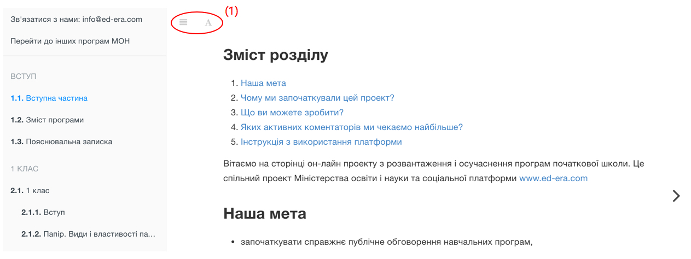
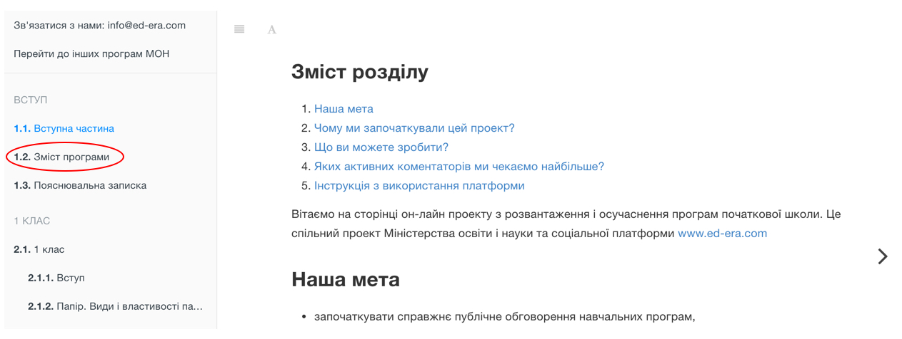
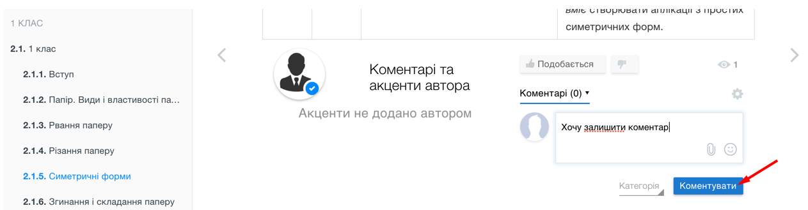
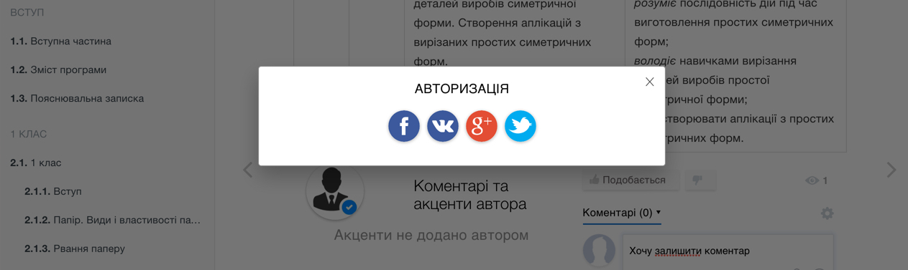
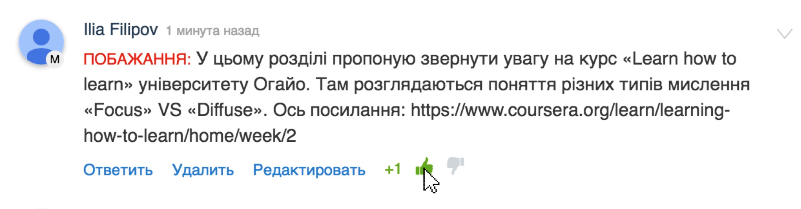

# Математика (Оновлено)

Перед вами оновлена версія програми за результатами коментарів дописувачів на EdEra та обговорень у робочих експертних групах після першого етапу публічного обговорення. Незабаром відкриється можливість коментування цієї програми, слідкуйте за новинами. 

Щоб побачити, що саме було змінено у цій програмі, потрібно перейти у розділ <a href="http://mathmon14-new.ed-era.com/opus_zmyn.html">«Опис ключових змін до проекту оновленої програми з математики»</a>.

<iframe width="560" height="315" src="https://www.youtube.com/embed/v5ZthJ0yOSU" frameborder="0" allowfullscreen></iframe>

1. [Наша мета](#zvernennya)
2. [Чому ми започаткували цей проект?](#chomu)
3. [Що ви можете зробити?](#vstup)
4. [Яких активних коментаторів ми чекаємо найбільше?](#yakih)
5. [Інструкція з використання платформи](#instruction)

Вітаємо на сторінці  онлайн проекту з розвантаження і осучаснення програм початкової школи. Це спільний проект Міністерства освіти і науки та соціальної платформи [www.ed-era.com](https://www.ed-era.com/).   

<iframe width="560" height="315" src="https://www.youtube.com/embed/dxBTgbPOMMo" frameborder="0" allowfullscreen></iframe>

##Наша мета  {#zvernennya}
* започаткувати справжнє публічне обговорення навчальних програм;
* перевірити програми на наявність помилок, повторів, невідповідностей та неузгодженостей;
* розвантажити програми від зайвої другорядної інформації, зробити їх більш зрозумілими для авторів підручників, вчителів, всіх освітян та широкого загалу;
* знайти педагогів, освітян, експертів та активістів, які розуміють, що таке компетентнісний підхід, і як його запроваджувати в повсякденній шкільній діяльності.

##Чому ми започаткували цей проект?{#chomu}
Міністерством освіти і науки за ініціативою міністра розпочато роботу з підготовки Концепції нової української школи. Вона передбачатиме нові стандарти, програми, підручники, нові підходи до підготовки вчителів. Ця Концепція буде впроваджуватися з 2018-го року – після ґрунтовного опрацювання та експериментальної апробації.    

Але діти вчаться вже зараз і не можуть чекати 2018-го року. Тому нинішній спільний проект Міносвіти і ЕdEra, який ми пропонуємо  – це не кардинальна зміна програм, і ми це усвідомлюємо.  
<u>Це нагальна необхідність:</u>      
* розвантажити чинні програми від обтяжливої інформації та застарілих підходів;
* залучити до процесу оновлення змісту освіти небайдужих освітян і експертів;
* надати вже зараз в межах чинного Державного стандарту приклади компетентнісного підходу та поширення кращих вчительських практик;
* зробити програми зрозумілішими і більш наближеними до вікових особливостей дітей і сучасного життя. 

Зміна стандартів та підходів до навчання в усіх розвинених країнах, що успішно здійснили реформу шкільної освіти (Канада, Фінляндія, Сінгапур, Польща), тривала не менше 10 років. Процес розвантаження програм для початкової школи – лише один з перших кроків у цьому напрямку. Велика реформа попереду, але ми вважаємо за необхідне вже зараз згуртувати навколо цієї роботи небайдужих освітян, експертів та активістів, які готові ділитися своїм досвідом заради покращення освіти українських дітей. 

##Що ви можете зробити?{#vstup}
<ol>
<li>Зареєструватися</li>
<li>Обрати і проаналізувати програму</li>     
<li>Конструктивно прокоментувати під відповідним розділом</li>  
<li>Стати ініціатором якісних змін</li></ol>

##Яких активних коментаторів ми чекаємо найбільше?{#yakih}

Ми шукаємо педагогів, вчителів, освітян, експертів та активістів, які розуміють важливість запровадження компетентнісного підходу в школах і знають як вже зараз, в умовах чинного стандарту, давати дітям справжнє компетентнісне навчання. На другому етапі проекту найцікавішим коментаторам буде запропоновано записати власні відеомайстеркласи з прикладами компетентнісного навчання.  <b>Ми шукаємо тих, хто хоче реально впливати на зміни!</b>  

##Інструкція з використання платформи{#instruction}
Зліва на кожній сторінці ви бачите зміст програми. За допомогою кнопки на панелі (1), 
зміст можна приховати та відкрити знову. На цій панелі також є кнопка у формі букви «А». Натиснувши на неї, ви відкриєте меню, в якому можна змінювати розмір кегля, режим відображення тощо.

 

Також зміст програми можна відкрити безпосередньо на сторінці <a href="http://mathmon14.ed-era.com/zmist.html">«Зміст програми»</a>.

 

Знизу, на кожній сторінці, надається можливість залишити коментар із побажаннями/зауваженнями/пропозиціями стосовно запровадження компетентнісного підходу. Для цього потрібно написати свій коментар і натиснути «Коментувати».

 

Якщо ви ще не авторизовані, система запропонує обрати вам варіант авторизації.

 

- Якщо у вас є побажання до конкретного розділу, оберіть його у змісті та прокоментуйте на відповідній  сторінці. 

- Якщо у вас є побажання до всієї програми, а не до конкретного розділу, залиште свій коментар на сторінці <a href="http://mathmon14.ed-era.com/zmist.html">«Зміст програми»</a>.

Звертаємо вашу увагу на систему голосування у коментарях. Чим більше позитивних відгуків стосовно вашого коментаря, тим швидше модератори звернуть на нього увагу і зроблять відповідний акцент, аби більше людей змогли одразу ознайомитися із корисною інформацією.

 

Не забувайте, що на платформі заборонені образи, порушення прав і свобод громадян України, нецензурна лексика.

Якщо у вас виникнуть технічні запитання, пишіть на <a href="mailto:info@ed-era.com">info@ed-era.com</a>. 

Бажаємо вам комфортної та продуктивної роботи на платформі!

<a href="http://hypercomments.com" class="hc-link" title="comments widget">comments powered by HyperComments</a>

